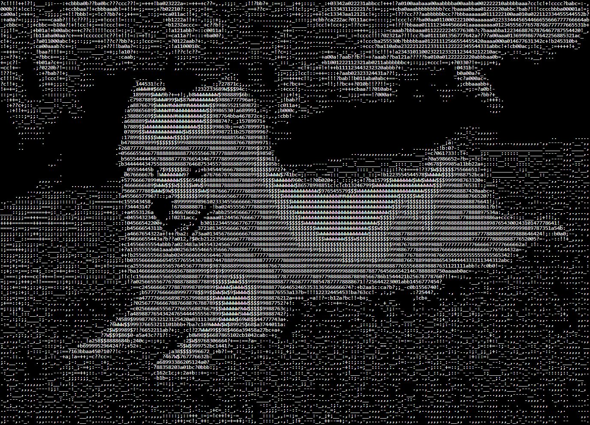

# ASCII Art 
This was my Harvard's CS50x 2022 final project submission. I have continued to work on and improved this project after that.  

Video demo: [Watch on YouTube](https://www.youtube.com/watch?v=kvW-cWD7sYY)



ASCII Art is a website that converts any image into ASCII character art. Basically what it means is that it generates an image made of ASCII characters (characters like !@#$%^&*_-+= etc) based on the character set you have chosen.

# Getting started
### Prerequisites
In order to use and work on this project, you should have atleast python 3.9 installed (3.10 or 3.11 recommended) on your pc to run the Flask app in your virtual environment locally.

### Installation
Clone this repository
``` terminal
git clone https://github.com/AyushShahh/ASCII-Art.git
```
Change your working directory to ASCII-Art and run this command to install required modules
```terminal
pip install -r requirements.txt
```

### Run development server locally
``` terminal
flask --debug run --host=0.0.0.0
```
`--debug` flag is used to auto-detect changes in your code and auto-restart the development server. It also allows you to locate any possible error and as well the location of the error, by logging a traceback of the error.

`--host=0.0.0.0` flag makes the server publicly available and tells your operating system to listen on all public IPs.

Your local server has started running. Navigate to [http://127.0.0.1:5000](http://127.0.0.1:5000)

If you would like to view this local site from other device(s), navigate to `http://(your laptop ipv4 address):5000` from your other device. for e.g. `http://192.168.1.100:5000`. Make sure your pc and the other device(s) are connected to the same network.

## Tech Stack
- Python
- HTML
- CSS
- JavaScript
- jQuery
- Jinja templating

## Libraries Used
- PIL - For python image processing
- Flask - For using flask features and jinja templating
- pillow_heif - Adding support for heic and heif images
- flask_sessions - For web browser sessions
- DOM to Image - To capture DOM snapshot using JavaScript
- Exif.js - For reading EXIF meta data from image files

# License
This project is licensed under the **MIT License**. View the [`LICENSE`](https://github.com/AyushShahh/ASCII-Art/blob/main/LICENSE) file for details.
